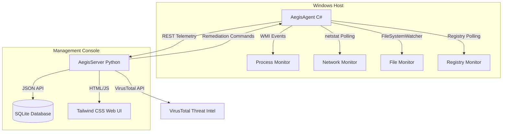

# AegisEDR: A Lightweight Endpoint Detection & Response Ecosystem

AegisEDR is a lightweight, low-footprint Endpoint Detection and Response (EDR) system designed for Windows endpoints. It features a dual-component architecture consisting of a C# systems monitoring agent and a centralized FastAPI management server with a real-time web dashboard.

This project is built to demonstrate systems programming, defensive security engineering, real-time telemetry analysis, and automated threat triage capabilities.

---

## Architecture & Workflow



---

## Key Features

1.  **Real-Time Process Monitoring (`WMI Process Trace`)**:
    *   Subscribes asynchronously to Windows process creation events.
    *   Triggers warnings and critical alerts for suspicious command lines (e.g. Volume Shadow Copy deletion via `vssadmin`, execution policy bypass in PowerShell, LOLbin execution via `certutil`).
    *   Triggers **Critical Alert** for LSASS memory dumps and credential theft tools (e.g. `comsvcs.dll` minidumps, `mimikatz` execution).
2.  **Outbound Network Connection Tracker**:
    *   Monitors established TCP connections, matching them to their owning process and PID.
    *   Flags connections made to suspicious external C2 ports (e.g. `4444`, `8888`, `8080`, `31337`).
3.  **Registry Persistence Auditing**:
    *   Watches standard startup run keys (`HKCU` and `HKLM` CurrentVersion\Run).
    *   Alerts on new entries pointing to user-writable folders (`Temp`, `AppData`) or running script files.
4.  **File Integrity & MD5 Hashing**:
    *   Uses `FileSystemWatcher` on User and Common Startup folders.
    *   Automatically hashes dropped executables and scripts.
5.  **VirusTotal API Integration**:
    *   Automatically checks file hashes against VirusTotal threat intelligence.
    *   Displays malicious/clean triage counts and links directly to VirusTotal reports.
6.  **Active Remediation & Containment**:
    *   **Process Kill**: Terminate target processes and all descendants remotely from the dashboard.
    *   **Host Isolation**: Uses Windows Firewall commands dynamically to isolate the compromised host from the network while maintaining agent-server communication.
    *   **Diagnostics**: Fetch real-time host hardware, OS, disk, and networking state.

---

## Tech Stack

*   **Endpoint Agent**: C# (.NET 10.0), Windows Management Instrumentation (WMI), Registry & File IO APIs.
*   **Central Server**: Python 3.13, FastAPI (ASGI), SQLAlchemy ORM, Uvicorn, Jinja2 Templates.
*   **Threat Intel**: VirusTotal API v3.
*   **Web Console**: HTML5, Tailwind CSS, FontAwesome, JavaScript.
*   **Database**: SQLite (Self-contained).

---

## Installation & Running

### Prerequisites
*   Windows 10/11 Endpoint
*   [.NET SDK 10.0+](https://dotnet.microsoft.com/download)
*   [Python 3.13+](https://www.python.org/downloads/)

### Step 1: Run the Server
1.  Navigate to the server directory:
    ```cmd
    cd AegisServer
    ```
2.  Install dependencies:
    ```cmd
    pip install -r requirements.txt
    ```
3.  Set your optional VirusTotal API Key:
    ```cmd
    set VIRUSTOTAL_API_KEY=your_api_key_here
    ```
4.  Start the FastAPI server:
    ```cmd
    python -m uvicorn main:app
    ```
5.  Open your browser to: `http://localhost:8000`

### Step 2: Run the Agent
To enable host isolation (firewall controls) and WMI bindings, run the agent as **Administrator**:

1.  Open PowerShell as Administrator and navigate to the agent directory:
    ```powershell
    cd AegisAgent
    ```
2.  Build the project:
    ```powershell
    dotnet build
    ```
3.  Execute the agent:
    ```powershell
    dotnet run
    ```

---

## Security Assessment & Testing Checklist

*   **Normal Telemetry**: Open Google Chrome or any browser; verify an `INFO` event records PID, Parent process, and Command Line.
*   **Threat Evasion Alerting**: Spawn PowerShell and execute an EP bypass download command. Verify `CRITICAL` alert pops up on the dashboard.
*   **LSASS Dumping Simulation**: Run a command like `rundll32.exe comsvcs.dll, MiniDump` or create a dummy file named `mimikatz.exe` and execute it. Verify a `CRITICAL` alert triggers.
*   **VirusTotal Triage**: Drop a file named `eicar.com` into the startup folder. Check the dashboard for the threat lookup rating card.
*   **Remediation**: Click **Remediate** next to an alert, select **Kill Process** or **Isolate Network** (ON), and verify containment on the endpoint.

---

## Disclaimer
This project is built for educational, research, and defensive demonstration purposes only. Ensure you have authorization before running the agent on any corporate network or monitored enterprise environments.
