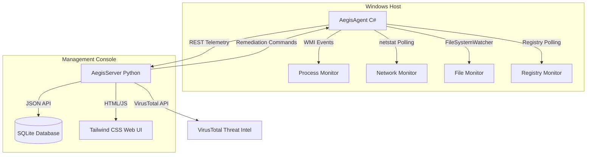

# 🛡️ AegisEDR: Lightweight Endpoint Detection & Response Ecosystem

AegisEDR is a lightweight, low-footprint Endpoint Detection and Response (EDR) system designed for Windows endpoints. It features a dual-component architecture consisting of a high-performance **C# (.NET 10.0)** systems monitoring agent and a centralized **FastAPI (Python 3.13)** management server with a real-time web dashboard.

This project demonstrates low-level systems programming, defensive security engineering, real-time Windows telemetry analysis, and automated threat triage & containment.

---

## 🏗️ Architecture & Workflow



---

## 🌟 Key Features

1. **Real-Time Process Monitoring (`WMI Process Trace`)**:
   - Subscribes asynchronously to Windows process creation events.
   - Triggers warnings and critical alerts for suspicious command lines (e.g., Volume Shadow Copy deletion via `vssadmin`, execution policy bypass in PowerShell, LOLbin execution via `certutil`).
   - Triggers **Critical Alerts** for LSASS memory dumps and credential theft tools (e.g., `comsvcs.dll` minidumps, `mimikatz` execution).
2. **Outbound Network Connection Tracker**:
   - Continuously monitors established TCP connections, matching each connection to its owning process and PID.
   - Flags connections made to suspicious external Command & Control (C2) ports (e.g., `4444`, `8888`, `8080`, `31337`).
3. **Registry Persistence Auditing**:
   - Watches standard startup run keys (`HKCU` and `HKLM` `CurrentVersion\Run`).
   - Alerts immediately on new entries pointing to user-writable directories (`Temp`, `AppData`) or running script engines.
4. **File Integrity & MD5 Hashing**:
   - Employs `FileSystemWatcher` on User and Common Startup directories.
   - Automatically computes MD5 hashes for dropped executables and scripts.
5. **VirusTotal Threat Intelligence Integration**:
   - Automatically queries file hashes against the VirusTotal API v3.
   - Displays real-time malicious/clean detection ratios and provides direct links to online threat reports.
6. **Active Remediation & Containment**:
   - **Process Kill**: Remotely terminate target processes and all descendant process trees from the dashboard.
   - **Host Isolation**: Dynamically generates Windows Firewall rules to isolate the compromised endpoint from the network while preserving EDR agent communication.
   - **Diagnostics**: Fetch real-time host hardware, OS, disk, and networking telemetry.

---

## 🛠️ Tech Stack

- **Endpoint Agent**: C# (.NET 10.0), Windows Management Instrumentation (WMI), Win32 APIs, Registry & File IO.
- **Central Server**: Python 3.13, FastAPI (ASGI), SQLAlchemy ORM, Uvicorn, Jinja2 Templates.
- **Threat Intel**: VirusTotal API v3.
- **Web Console**: HTML5, Tailwind CSS, FontAwesome, JavaScript.
- **Database**: SQLite (Self-contained, zero-configuration).

---

## 🚀 Installation & Running

### Prerequisites
- **Operating System**: Windows 10 or Windows 11.
- **[.NET SDK 10.0+](https://dotnet.microsoft.com/download)** installed.
- **[Python 3.10+](https://www.python.org/downloads/)** installed.

### Step 1: Start the Central Management Server
1. Navigate to the server folder:
   ```cmd
   cd AegisServer
   ```
2. Install Python dependencies:
   ```cmd
   pip install -r requirements.txt
   ```
3. *(Optional)* Set your VirusTotal API key:
   ```cmd
   set VIRUSTOTAL_API_KEY=your_virustotal_api_key_here
   ```
4. Start the FastAPI server:
   ```cmd
   python -m uvicorn main:app --reload
   ```
5. Open your web browser and navigate to: **`http://localhost:8000`**

### Step 2: Start the Endpoint Agent
The agent must be run with **Administrator privileges** to enable WMI process monitoring and Windows Firewall host isolation rules:

1. Open PowerShell as **Administrator** and navigate to the agent folder:
   ```powershell
   cd AegisAgent
   ```
2. Build the project:
   ```powershell
   dotnet build
   ```
3. Run the agent:
   ```powershell
   dotnet run
   ```

---

## 🧪 Testing & Verification Checklist

- **Normal Telemetry**: Launch any browser or application; verify an `INFO` event records the PID, parent process, and command line.
- **Execution Policy Bypass Alert**: Launch PowerShell and execute a simulated download cradle. Verify a `CRITICAL` alert triggers in the dashboard.
- **LSASS Dump Simulation**: Run a command containing `rundll32.exe comsvcs.dll, MiniDump` or create a dummy file named `mimikatz.exe` to trigger a credential theft detection.
- **Remote Containment**: In the dashboard, click **Remediate** next to an alert and choose **Isolate Host** or **Kill Process** to observe endpoint action.

---

## ⚠️ Disclaimer
This project is developed solely for educational, defensive security research, and system engineering demonstration purposes. Always obtain explicit authorization before deploying monitoring agents in any production or corporate environment.
